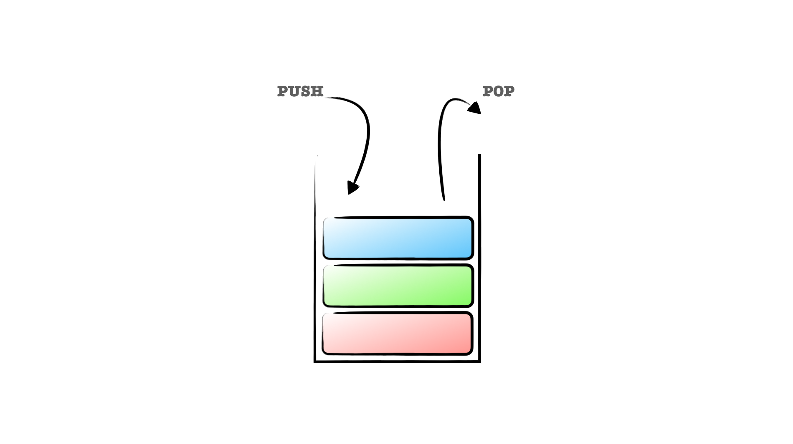

# 3. 스택 (Stack)

스택(Stack)은 LIFO(Last In First Out) 입출력 구조를 가진 선형 자료구조로서, 가장 늦게 PUSH 된 요소가 가장 빠르게 POP 되는 구조이다.

<figure><figcaption>
스택 자료 구조의 예시
</figcaption></figure>

스택은 자바스크립트의 배열로서 쉽게 표현가능하지만, 몇 가지 유틸성 메서드를 가지고 있는 클래스로 구현해볼 수 있다.

<figure><figcaption>
배열을 이용한 스택 구현
</figcaption></figure>

<figure><figcaption>
클래스를 이용한 스택 구현
</figcaption></figure>

