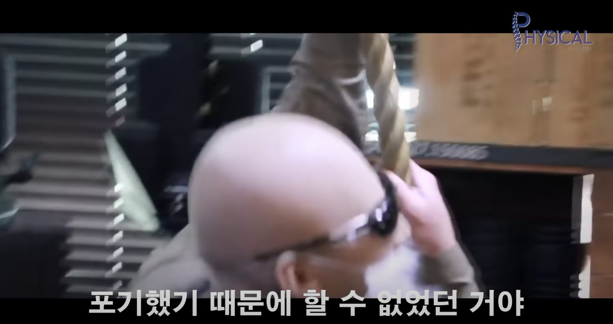

# 1. 제발 오래가길 바라는 염원을 담아

<figure><figcaption>
할 수가 없었기 때문에 포기한 게 아니라, 포기했기 때문에 할 수 없었던 거야
</figcaption></figure>

정말이지, 알고리즘 공부는 꺼내들기 쉽지 않다. 성장 그래프의 가파른 경사를 그리기 전까지의 평탄한 곡선에서 성취감의 자극이 없는 오랜 기분을 견디기 힘들다. 그러곤 맥없이 과제 전형의 채용을 열심히 찾았다.&#x20;

코딩 테스트가 포함된 큰 기업들의 채용공고는 손가락 빨며 지원도 못하는 모습이 부끄럽지 않은지 실실 포기해왔다. 사실 근래 코딩 테스트 준비가 가성비가 떨어진다는 말을 자주 듣곤 했다. 그래도, 적어도, 어느 수준까지 공부를 마친 후에 가성비가 떨어지더라 스스로 느껴보는 게 수순에 맞다고 본다.

이렇게 감성 담아 알고리즘 공부에 대한 넋두리를 적은 것이, 오랜 동기부여가 돼서 문제 하나 더 들여다보는 자극제가 되길 바란다 제발루.

###

