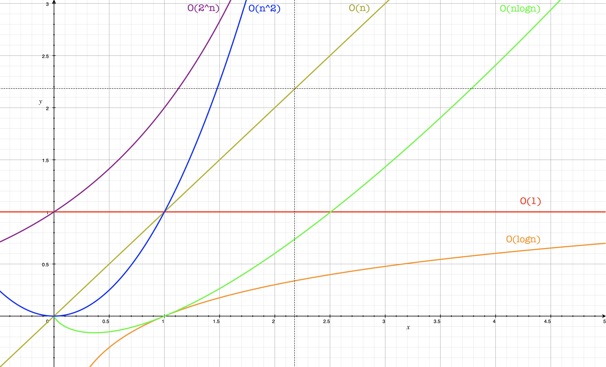

# 2. 시간 복잡도 (Time Complexity)

### 프로그램 성능을 정확히 측정할 수 있을까?

프로그램의 성능을 정확히 측정하기 위해 입력 크기, 하드웨어, 운영체제의 성능, 컴파일러의 최적화 정도, 비동기 로직의 사이드 이펙트 등을 고려해야 한다. 사실상 프로그램의 성능을 측정할 때 필요에 따라 그 정확도를 높일 수 있지만, 정확히 측정하기는 어렵다.&#x20;

여기서 우리는 시간 복잡도 (Time Complexity) 라는 개념을 사용한다. 입력값이 변화할 때, 연산 횟수에 비해 얼마만큼의 시간이 소요되는지에 대한 상대적이고, 대략적인 지표를 표현한다.

### 빅오 표기법 (Big-0 notation)

빅오 표기법 (Big-O notation)은 시간 복잡도를 표현하기 위한 방법 중 하나이다.&#x20;

<figure><figcaption><p>빅오 표기법(Big-O notation) 그래프 비교</p></figcaption></figure>

한번쯤은 직접 그려보고 싶었던 그래프이다. x축 최대값이 작아 표현이 부족하지만, y축에 가깝게 기울기가 형성되어 있는 순으로 시간 복잡도는 커지며 급격히 시간이 증가한다. 수식으로 비교하면 다음과 같다.

$$O(1) < O(logn) < O(n) < O(nlogn) < O(n^2) < O(2^n) < O(n!)$$

차례대로 상수 시간,  로그 시간, 선형 시간, 선형 로그 시간, 2차 시간, 지수 시간, 팩토리얼 시간으로 부른다.&#x20;

### 점근적 표기법

빅오 표기법은 점근적 표기법을 따른다. 함수의 증가 추세를 표현하는 표기법으로 식의 계수나 상수를 더하는 등의 식은 식에 포함시키지 않는다.&#x20;

$$O(3n^2 + 126) \ is \ O(n^2) , \ O(2n + 1) \ is \  O(n)$$

> <mark style="color:blue;">정리하자면,</mark> <mark style="color:blue;"></mark><mark style="color:blue;">**상수항은 무시하고 가장 큰 항 외엔 무시된다.**</mark>

### 예제 코드로 살펴보자

먼저, 선형 시간이다. 단순히 n번을 실행하는 경우이다.

```javascript
for (let i = 0; i < n; i += 1) {
  // ... 
}
```

로그 시간은 n에 로그를 씌운 횟수 만큼을 실행하는 경우이다. 선형 시간과 로그 시간의 차이는 크다. 선형 시간에서 1024번 루프를 돌며 실행되는 경우, 로그 시간에서는 단 10번 루프를 돌게 된다.

```javascript
for (let i = 0; i <= n; i *= 2) {
  // ... 
}
```

선형 로그 시간은 로그 시간과 동일한 루프를 선형 시간의 n번 만큼 실행하는 경우이다.

```javascript
for (let i = 0; i < n; i += 1) {
  for (let j =0; j <= n; j *= 2) {
    // ...
  } 
}
```

2차 시간은 선형 시간과 동일한 루프를 선형 시간의 n번 만큼 실행하는 경우이다.

```javascript
for (let i = 0; i < n; i += 1) {
  for (let j =0; j < n; j += 1) {
    // ...
  } 
}
```

지수 시간과 팩토리얼 시간의 경우, 가급적 사용되지 않아야 하는 시간 복잡도이다.&#x20;
