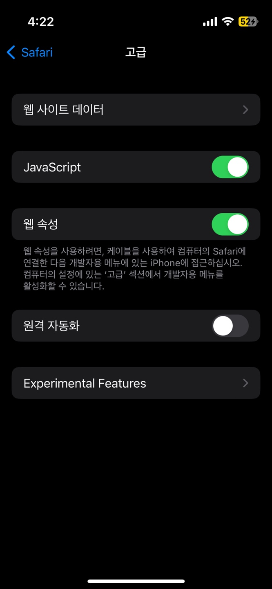

# 2. 아이폰 사파리 로그를 맥북에서 확인하기

### 1. iPhone 사파리 설정

사파리 고급 설정/웹 속성을 켜주고, 디버깅 로그를 받을 맥북과 같은 디바이스에 USB로 연결이 필요하다.

### 2. 맥북 사파리 설정

맥북 사파리 고급 설정/메뉴 막대에서 개발자용 메뉴 보기를 켜준다.

<figure><figcaption></figcaption></figure>

사파리의 개발자용 탭에서 연결된 디바이스를 선택한다.

<figure><figcaption></figcaption></figure>

로그 확인 및 디버깅!

<figure><figcaption></figcaption></figure>
